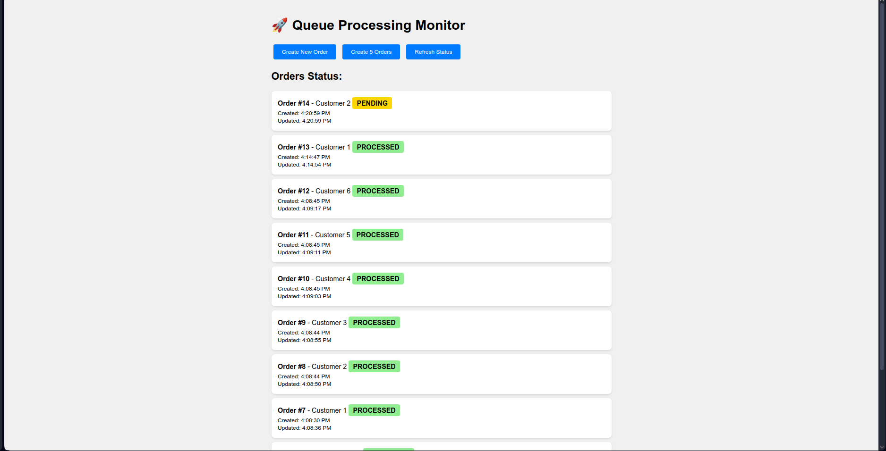

# Food Delivery Order Processing System

## Project Overview
A scalable backend service for processing food delivery orders using Spring Boot, MySQL, and an in-memory queue system.

## Features
- RESTful API for order management
- Asynchronous order processing using queue simulation
- Order status tracking (PENDING → PROCESSING → PROCESSED)
- Pagination support for listing orders
- Comprehensive error handling and validation
- MySQL database with JPA/Hibernate

## Tech Stack
- Java 17
- Spring Boot 3.x
- MySQL 8.0
- Spring Data JPA
- In-Memory Queue (BlockingQueue)
- Lombok
- Gradle

## Setup Instructions

### Prerequisites
- Java 17 or higher
- Docker (for MySQL) or MySQL 8.0 installed locally
- Gradle 7.x or higher
- Postman or curl (for API testing)

### Step 1: Clone the Repository
```bash
git clone https://github.com/kashish2310/food-delivery-order-system.git
cd food-delivery-order-system
```

### Step 2: 

## 1. Set up MySQL Database

## Option A
```bash
docker run --name mysql-food-delivery \
  -e MYSQL_ROOT_PASSWORD=root \
  -e MYSQL_DATABASE=food_delivery_db \
  -p 3306:3306 \
  -d mysql:8.0
```
## Option B: Using Local MySQL

- Login to MySQL: mysql -u root -p
- Create database: CREATE DATABASE food_delivery_db;
- Update credentials in application.properties

## 2. Apply Migration Script: Run the provided SQL script to create the database and tables
- schema.sql is in root directory

```bash
mysql -u root -p < schema.sql
```

## Step 3: Configure Database Connection
# Update src/main/resources/application.properties:

- spring.datasource.url=jdbc:mysql://localhost:3306/food_delivery_db?createDatabaseIfNotExist=true&useSSL=false&allowPublicKeyRetrieval=true
- spring.datasource.username=root
- spring.datasource.password=root
- spring.jpa.hibernate.ddl-auto=update

## Step 4: BUild & run application:
```bash
./gradlew clean build
./gradlew bootRun

```
- The application will start on ```http://localhost:8080```

## Step 5: TEsting the APIs
# Using curl commands:
# 1.CReate order:
```bash
curl -X POST http://localhost:8080/api/orders \
  -H "Content-Type: application/json" \
  -d '{
    "customerName": "Kashish",
    "items": [
        {"name": "Pizza Margherita", "quantity": 2, "price": 12.99},
        {"name": "Coca Cola", "quantity": 2, "price": 2.50}
    ],
    "totalAmount": 30.98
}'
```

# 2.Get All Orders (Paginated)
```bash
curl http://localhost:8080/api/orders?page=0&size=10&sortBy=createdAt&sortDirection=DESC
```
# 3. Get Order by ID
```bash
curl http://localhost:8080/api/orders/1
```
# 4. Get Order Status
```bash
curl http://localhost:8080/api/orders/1/status
```

# 5. Update Order Status Manually
```bash
curl -X PUT "http://localhost:8080/api/orders/1/status?status=DELIVERED"
```

## Sample Payloads and Responses
# Create Order Request
```json
{
    "customerName": "Kashish Tibrewal",
    "items": [
        {
            "name": "Burger Deluxe",
            "quantity": 1,
            "price": 15.99
        },
        {
            "name": "French Fries",
            "quantity": 2,
            "price": 4.99
        }
    ],
    "totalAmount": 25.97
}

```

# Create Order Response (201 Created)

```json
{
    "id": 1,
    "customerName": "Kashish Tibrewal",
    "items": "[{\"name\":\"Burger Deluxe\",\"quantity\":1,\"price\":15.99},{\"name\":\"French Fries\",\"quantity\":2,\"price\":4.99}]",
    "totalAmount": 25.97,
    "orderTime": "2024-01-15T14:30:45",
    "status": "PENDING",
    "createdAt": "2024-01-15T14:30:45",
    "updatedAt": "2024-01-15T14:30:45"
}
```

### Queue Simulation TEsting INstructions:
## Overview
This application uses an in-memory BlockingQueue to simulate AWS SQS for asynchronous order processing.

## ARchitecture
- Order Created → Queue Producer → BlockingQueue → Queue Consumer → Process Order → Update Status

## 1. TEst via - Real-Time Queue Monitor Dashboard:
### Visual Monitoring Interface
The application includes a real-time web dashboard for monitoring order processing and queue status.

### Accessing the Dashboard
Navigate to: `http://localhost:8080/monitor`

### Dashboard Features
- **Live Statistics**: Total orders, queue size, and status distribution
- **Real-time Updates**: Auto-refreshes every 2 seconds
- **Order Management**: Create single or bulk orders with one click
- **Visual Status Tracking**: Color-coded order cards showing status progression
- **Processing Timeline**: View when orders were created and last updated

### Dashboard Screenshots


## Queue Metrics

- Capacity: 1000 orders
- Processing Time: 4-7 seconds per order
- Concurrency: 2-5 parallel processors
- Poll Interval: 1 second

## 2. Testing via curl commands-
### Step 1: Enable Debug Logging
- Add to `application.properties`:
```properties
logging.level.com.limetray.springapp.queue=DEBUG

```

### Step 2: Create Multiple Orders
Run this script to create 5 orders:
```bash
for i in {1..5}; do
  curl -X POST http://localhost:8080/api/orders \
    -H "Content-Type: application/json" \
    -d "{
      \"customerName\": \"Customer $i\",
      \"items\": [{\"name\": \"Item $i\", \"quantity\": 1, \"price\": 10.00}],
      \"totalAmount\": 10.00
    }"
  echo ""
done
```

### Step 3: MOnitor Processing: watch the app logs
```bash
tail -f logs/spring-boot-logger.log
```
# EXpected log sequence

14:30:01 INFO  - Order 1 added to queue for processing
14:30:02 INFO  - Processing order: 1
14:30:02 INFO  - Order 1 status updated to PROCESSING
14:30:06 INFO  - Order 1 status updated to PROCESSED
14:30:06 INFO  - Order 1 processed successfully

### Step 4: Verify Status Changes: Check order status progression
```bash
# Check immediately 
curl http://localhost:8080/api/orders/1/status
# Response: {"orderId": 1, "status": "PENDING"}

# Wait 3 seconds
curl http://localhost:8080/api/orders/1/status
# Response: {"orderId": 1, "status": "PROCESSING"}

# Wait 5 more seconds
curl http://localhost:8080/api/orders/1/status
# Response: {"orderId": 1, "status": "PROCESSED"}
```

## Simulating Queue Failures
To test error handling:
- Stop MySQL while orders are processing
- Create orders with invalid data


